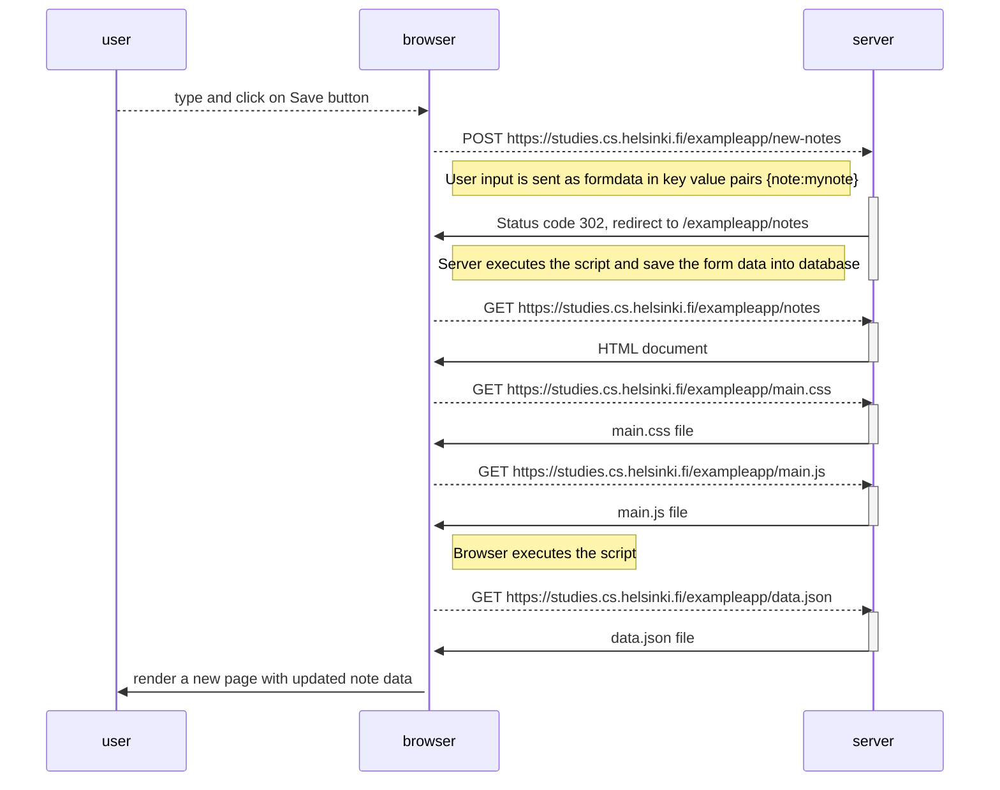

```mermaid
sequenceDiagram
    participant user
    participant browser
    participant server

    user-->>browser: type and click on Save button
    activate browser

    browser-->>server: POST  https://studies.cs.helsinki.fi/exampleapp/new-notes

    
    Note right of browser: User input is sent as formdata in key value pairs {note:mynote}


    activate server
    server->>browser: Status code 302, redirect to  /exampleapp/notes

    Note right of browser: Server executes the script and save the form data into database

    deactivate server

    browser-->>server: GET https://studies.cs.helsinki.fi/exampleapp/notes
    activate server
    server->>browser: HTML document
    deactivate server

    browser-->>server: GET https://studies.cs.helsinki.fi/exampleapp/main.css
    activate server
    server->>browser: main.css file
    deactivate server

    browser-->>server: GET https://studies.cs.helsinki.fi/exampleapp/main.js
    activate server
    server->>browser: main.js file
    deactivate server

    Note right of browser: Browser executes the script

    browser-->>server: GET https://studies.cs.helsinki.fi/exampleapp/data.json
    activate server
    server->>browser: data.json file
    deactivate server

    browser->>user: render a new page with updated note data


```