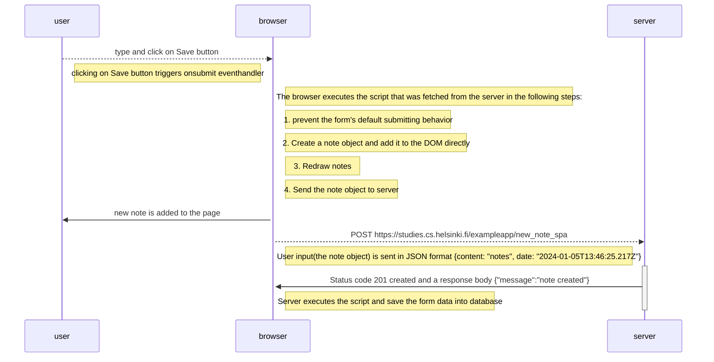

```mermaid
sequenceDiagram
    participant user
    participant browser
    participant server

    user-->>browser: type and click on Save button
    activate browser

    Note right of user: clicking on Save button triggers onsubmit eventhandler

    Note right of browser: The browser executes the script that was fetched from the server in the following steps:

    Note right of browser: 1. prevent the form's default submitting behavior

    Note right of browser: 2. Create a note object and add it to the DOM directly

    Note right of browser: 3. Redraw notes

    Note right of browser: 4. Send the note object to server


    browser->>user: new note is added to the page


    browser-->>server: POST  https://studies.cs.helsinki.fi/exampleapp/new_note_spa

    
    Note right of browser: User input(the note object) is sent in JSON format {content: "notes", date: "2024-01-05T13:46:25.217Z"}


    activate server
    server->>browser: Status code 201 created and a response body {"message":"note created"}

    Note right of browser: Server executes the script and save the form data into database

    deactivate server

   


```