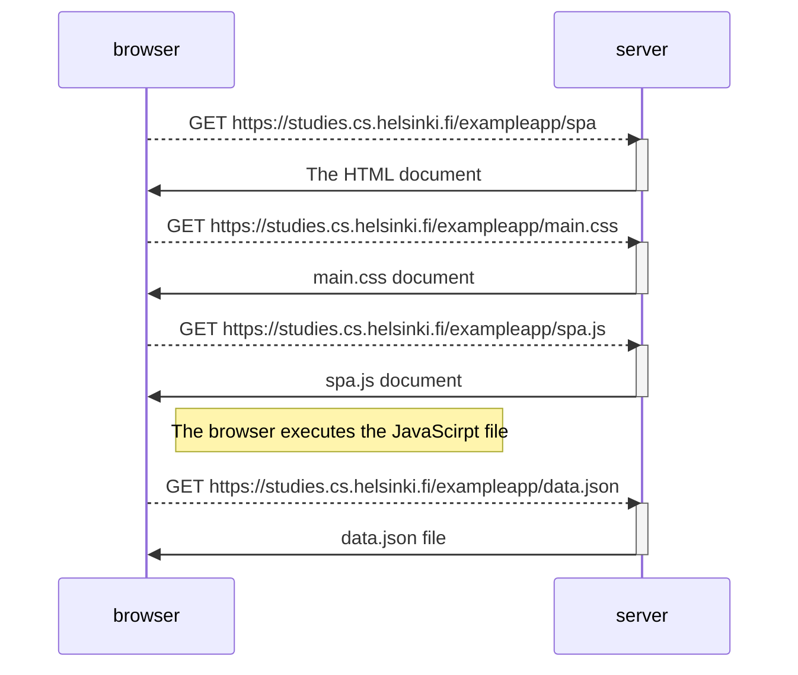

```mermaid
sequenceDiagram

    participant browser
    participant server

    browser-->>server: GET  https://studies.cs.helsinki.fi/exampleapp/spa
    activate server

    server->>browser: The HTML document
    deactivate server

    browser-->>server: GET https://studies.cs.helsinki.fi/exampleapp/main.css
    activate server
    server->>browser: main.css document
    deactivate server

    browser-->>server:GET https://studies.cs.helsinki.fi/exampleapp/spa.js
    activate server
    server->>browser:spa.js document
    deactivate server

    Note right of browser: The browser executes the JavaScirpt file

    browser-->>server:GET https://studies.cs.helsinki.fi/exampleapp/data.json
    activate server
    server->>browser:data.json file
    deactivate server

```